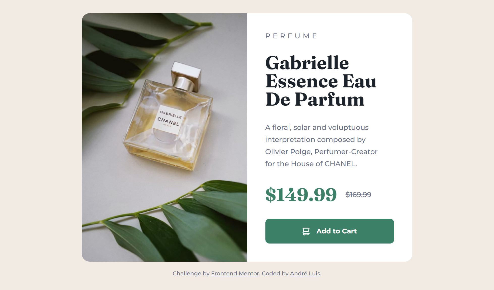

<h1 align="center"> Frontend Mentor - Product preview card component solution </h1>

This is a solution to the [Product preview card component challenge on Frontend Mentor](https://www.frontendmentor.io/challenges/product-preview-card-component-GO7UmttRfa). Frontend Mentor challenges help you improve your coding skills by building realistic projects.

 

  <a href="#-tecnologias">Tecnologias</a>&nbsp;&nbsp;&nbsp;|&nbsp;&nbsp;&nbsp;
  <a href="#-projeto">Projeto</a>&nbsp;&nbsp;&nbsp;|&nbsp;&nbsp;&nbsp;
  <a href="#-screenshots">Screenshots</a>&nbsp;&nbsp;&nbsp;|&nbsp;&nbsp;&nbsp;
  <a href="#-links">Links</a>&nbsp;&nbsp;&nbsp;

 

## 🚀 Tecnologias

Esse projeto foi desenvolvido com as seguintes tecnologias:

- HTML e CSS

## 💻 Projeto

O desafio era construir esse card de maneira responsiva, o qual se adeque a diferentes tamanhos de tela (desktop e mobile). Para isso foi utilizado Flex e Media queries do CSS

## 📸 Screenshots

  
  

## 🌎 Links

- Solution: [https://www.frontendmentor.io/solutions/product-preview-card-component-html-css-LqdVVozvTg](https://www.frontendmentor.io/solutions/product-preview-card-component-html-css-LqdVVozvTg)
- Live Site: [https://product-preview-card-aandreluis.netlify.app/](https://product-preview-card-aandreluis.netlify.app/)

---
